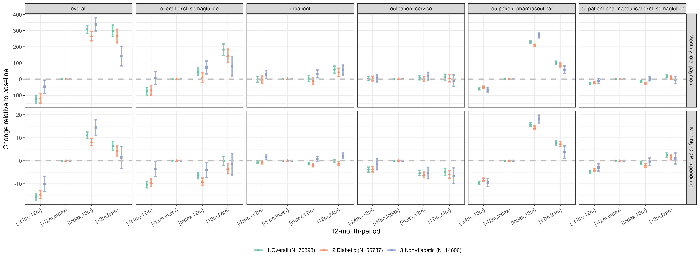
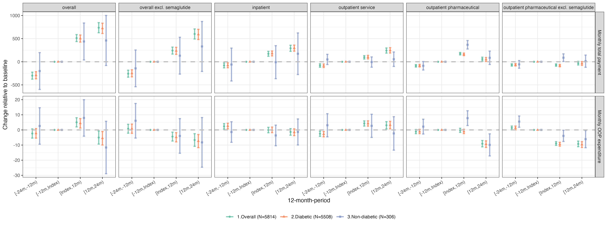
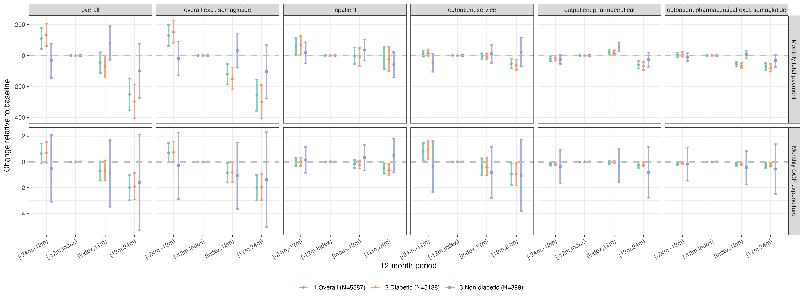

# previous work replication using marketscan data 
- Changes in Cardiovascular Risk Factors and Healthcare Expenditure Among Patients Initiating Semaglutide: A Multicenter Analysis of Electronic Health Records 

--- 
## CCAE (Commercial Claims and Encounters)

### Cohort Construction Flow
1. **Initial Data Assessment**
   - Total outpatient pharmaceutical (D) records: 2,378,303,451
   - Total unique patients in pharmaceutical data: 67,176,383
2. **Semaglutide User Identification**
   - Identified semaglutide orders: 7,365,976
   - Unique patients with semaglutide orders: 722,970

3. **Enrollment Criteria Application**
   - Total enrollment records: 332,870,703
   - Total unique patients in enrollment data: 111,768,892
   - Applied continuous enrollment filter to 722,970 semaglutide users: need to have 5 full years of enrollment records
     - eg  2018,2019, 2020 (first semaglutide order year), 2021, 2022 enrollment needed for patients with first semaglutide order in 2020
     - **Final cohort with 5 full years of enrollment: 70,393 (9.74%)**

4. **Enrollment Distribution**
   - 0 years: 81,120 patients (11.22%)
   - 1 year: 107,970 patients (14.94%)
   - 2 years: 139,588 patients (19.31%)
   - 3 years: 214,848 patients (29.72%)
   - 4 years: 109,003 patients (15.08%)
   - 5 years: 70,393 patients (9.74%)
        

### Data Summary Tables

| Data Type | Total Records | Total Enrollees | Cohort Records | Cohort Patients |
|-----------|---------------|----------------|----------------|-----------------|
| Lab data (r) | 915,781,306 | 10,216,389 | 170,839* | 722,970 |
| Inpatient service (s) | 457,340,872 | 9,326,880 | 2,167,855 | 24,809 |
| Inpatient admission (i) | 14,435,204 | 9,326,880 | 54,474 | 24,809 |
| Outpatient service (o) | 6,930,282,387 | 89,709,466 | 39,794,920 | 70,374 |
| Outpatient pharmaceutical (d) | 2,378,303,451 | 67,176,383 | 24,906,065 | 70,393 |

*Selected lab records for the baseline semaglutide cohort (BP, BMI, WEIGHT, HBA1C, CHOLESTEROL)

### Table 1: Cohort Characteristics
| | | | Grouped by Diabetes history | | | |
|---|---|---|---|---|---|---|
| | | Missing | Overall | No Prior Diabetes | Prior Diabetes | P-Value |
| n | | | 70393 | 14606 | 55787 | |
| Age, median [Q1,Q3] | | 0 | 52.0 [45.0,57.0] | 47.0 [40.0,53.0] | 53.0 [47.0,57.0] | <0.001 |
| Sex, n (%) | Female | | 42310 (60.1) | 11571 (79.2) | 30739 (55.1) | <0.001 |
| | Male | | 28083 (39.9) | 3035 (20.8) | 25048 (44.9) | |
| First semaglutide - brand name, n (%) | Ozempic | | 52774 (75.0) | 8143 (55.8) | 44631 (80.0) | <0.001 |
| | RYBELSUS | | 12264 (17.4) | 2011 (13.8) | 10253 (18.4) | |
| | WEGOVY | | 5355 (7.6) | 4452 (30.5) | 903 (1.6) | |
| First semaglutide - dosage form, n (%) | INJECTION, SOLUTION | | 58129 (82.6) | 12595 (86.2) | 45534 (81.6) | <0.001 |
| | TABLET | | 12264 (17.4) | 2011 (13.8) | 10253 (18.4) | |
| First semaglutide - total payment, median [Q1,Q3] | | 0 | 825.7 [771.1,1307.8] | 849.2 [796.3,1311.7] | 822.6 [765.7,1240.9] | <0.001 |
| First semaglutide - out-of-pocket payment, median [Q1,Q3] | | 0 | 50.0 [25.0,100.0] | 55.8 [25.0,120.0] | 50.0 [25.0,100.0] | <0.001 |
| Average monthly total payment, median [Q1,Q3] | | 0 | 1176.4 [707.8,1982.8] | 876.0 [523.4,1471.5] | 1265.0 [772.5,2113.4] | <0.001 |
| Average monthly out-of-pocket payment, median [Q1,Q3] | | 0 | 146.5 [85.5,228.7] | 117.0 [63.8,193.2] | 154.3 [92.2,236.2] | <0.001 |

### Expenditure outcome
- Model specification
  - 4 12-month periods
  - Random effect
    - Outcome: Monthly cost (Aggregated for all calendar months identified)
      - Source:
        - Total (Inpatient admission + Outpatient service + Outpatient pharmaceutical)
        - Total (Inpatient admission + Outpatient service +  Outpatient pharmaceutical excluding semaglutide)
        - Inpatient admission
        - Outpatient service
        - Outpatient pharmaceutical
        - Outpatient pharmaceutical excluding semaglutide 
      - Payment type:
        - Total payment
        - Out-of-pocket payment (OOP): Deductible + Copay + Coinsurance

- Result:
  - 

--- 
## MDCR (Medicare)

### Cohort Construction Flow
1. **Initial Data Assessment**
   - Total outpatient pharmaceutical (D) records: 533137777
   - Total unique patients in pharmaceutical data: 4,963,073
2. **Semaglutide User Identification**
   - Identified semaglutide orders: 633995
   - Unique patients with semaglutide orders: 70591

3. **Enrollment Criteria Application**
   - Total enrollment records: 22650837
   - Total unique patients in enrollment data: 6481621
   - Applied continuous enrollment filter to 70591 semaglutide users: need to have 5 full years of enrollment records
     - eg  2018,2019, 2020 (first semaglutide order year), 2021, 2022 enrollment needed for patients with first semaglutide order in 2020
     - **Final cohort with 5 full years of enrollment: 5,814 (8.25%)**

4. **Enrollment Distribution**
   - 0 years: 8,258 patients (11.72%)
   - 1 year: 10,141 patients (14.39%)
   - 2 years: 18,079 patients (25.66%)
   - 3 years: 18,583 patients (26.37%)
   - 4 years: 9,589 patients (13.61%)
   - 5 years: 5,814 patients (8.25%)
        

### Data Summary Tables

| Data Type | Total Records | Total Enrollees | Cohort Records | Cohort Patients |
|-----------|---------------|----------------|----------------|-----------------|
| Lab data (r) | 532,466,348 | 1,038,823 | 58,516* | 1,833 |
| Inpatient service (s) | 158,766,848 | 1,816,692 | 365,734 | 3,280 |
| Inpatient admission (i) | 3,959,288 | 1,816,691 | 9,652 | 3,280 |
| Outpatient service (o) | 1,274,602,087 | 6,051,468 | 4,705,885 | 5,813 |
| Outpatient pharmaceutical (d) | 533,137,777 | 4,963,073 | 2,382,402 | 5,814 |

*Selected lab records for the baseline semaglutide cohort (BP, BMI, WEIGHT, HBA1C, CHOLESTEROL)

### Table 1: Cohort Characteristics
| | | | Grouped by Diabetes history | | | |
|---|---|---|---|---|---|---|
| | | Missing | Overall | No Prior Diabetes | Prior Diabetes | P-Value |
| n | | | 5814 | 306 | 5508 | |
| Age, median [Q1,Q3] | | 0 | 72.0 [69.0,75.0] | 70.0 [68.0,73.0] | 72.0 [69.0,75.0] | <0.001 |
| Sex, n (%) | Female | | 2986 (51.4) | 223 (72.9) | 2763 (50.2) | <0.001 |
| | Male | | 2828 (48.6) | 83 (27.1) | 2745 (49.8) | |
| First semaglutide - brand name, n (%) | Ozempic | | 4510 (77.6) | 246 (80.4) | 4264 (77.4) | <0.001 |
| | RYBELSUS | | 1290 (22.2) | 51 (16.7) | 1239 (22.5) | |
| | WEGOVY | | 14 (0.2) | 9 (2.9) | 5 (0.1) | |
| First semaglutide - dosage form, n (%) | INJECTION, SOLUTION | | 4524 (77.8) | 255 (83.3) | 4269 (77.5) | 0.020 |
| | TABLET | | 1290 (22.2) | 51 (16.7) | 1239 (22.5) | |
| First semaglutide - total payment, median [Q1,Q3] | | 0 | 851.3 [769.3,1536.3] | 1051.4 [799.6,1457.9] | 847.2 [768.2,1536.3] | 0.064 |
| First semaglutide - out-of-pocket payment, median [Q1,Q3] | | 0 | 40.2 [0.0,60.0] | 45.0 [15.0,75.0] | 40.0 [0.0,56.0] | <0.001 |
| Average monthly total payment, median [Q1,Q3] | | 0 | 1612.7 [1032.0,2523.0] | 1000.9 [635.3,1604.2] | 1652.8 [1068.0,2574.7] | <0.001 |
| Average monthly out-of-pocket payment, median [Q1,Q3] | | 0 | 88.6 [55.6,134.0] | 77.3 [46.8,112.1] | 89.2 [56.0,135.3] | <0.001 |

### Expenditure outcome
- Model specification
  - 4 12-month periods
  - Random effect
    - Outcome: Monthly cost (Aggregated for all calendar months identified)
      - Source:
        - Total (Inpatient admission + Outpatient service + Outpatient pharmaceutical)
        - Total (Inpatient admission + Outpatient service +  Outpatient pharmaceutical excluding semaglutide)
        - Inpatient admission
        - Outpatient service
        - Outpatient pharmaceutical
        - Outpatient pharmaceutical excluding semaglutide 
      - Payment type:
        - Total payment
        - Out-of-pocket payment (OOP): Deductible + Copay + Coinsurance

- Result:
  - 

--- 
## Medicaid

### Cohort Construction Flow
1. **Initial Data Assessment**
   - Total outpatient pharmaceutical (D) records:  1124520771
   - Total unique patients in pharmaceutical data: 
2. **Semaglutide User Identification**
   - Identified semaglutide orders: 262482
   - Unique patients with semaglutide orders:  41557

3. **Enrollment Criteria Application**
   - Total enrollment records: 124576349
   - Total unique patients in enrollment data: 27944500
   - Applied continuous enrollment filter to 41557 semaglutide users: need to have 5 full years of enrollment records
     - eg  2018,2019, 2020 (first semaglutide order year), 2021, 2022 enrollment needed for patients with first semaglutide order in 2020
     - **Final cohort with 5 full years of enrollment: 5,587 (13.44%)**

4. **Enrollment Distribution**
   - 0 years: 1,991 patients (4.79%)
   - 1 year: 3,869 patients (9.31%)
   - 2 years: 7,883 patients (18.97%)
   - 3 years: 15,363 patients (36.97%)
   - 4 years: 6,863 patients (16.52%)
   - 5 years: 5,587 patients (13.44%)

### Data Summary Tables

| Data Type | Total Records | Total Enrollees | Cohort Records | Cohort Patients |
|-----------|---------------|----------------|----------------|-----------------|
| Lab data (r) | No data | No data | No data | No data |
| Inpatient service (s) | 463,759,602 | 7,545,916 | 453,007 | 3,318 |
| Inpatient admission (i) | 14,177,354 | 7,545,916 | 11,005 | 3,318 |
| Outpatient service (o) | 4,717,674,233 | 22,382,638 | 6,737,852 | 5,517 |
| Outpatient pharmaceutical (d) | 1,124,520,771 | 18,081,425 | 3,993,902 | 5,587 |

*Selected lab records for the baseline semaglutide cohort (BP, BMI, WEIGHT, HBA1C, CHOLESTEROL)

### Table 1: Cohort Characteristics
| | | | Grouped by Diabetes history | | | |
|---|---|---|---|---|---|---|
| | | Missing | Overall | No Prior Diabetes | Prior Diabetes | P-Value |
| n | | | 5814 | 306 | 5508 | |
| Age, median [Q1,Q3] | | 0 | 72.0 [69.0,75.0] | 70.0 [68.0,73.0] | 72.0 [69.0,75.0] | <0.001 |
| Sex, n (%) | Female | | 2986 (51.4) | 223 (72.9) | 2763 (50.2) | <0.001 |
| | Male | | 2828 (48.6) | 83 (27.1) | 2745 (49.8) | |
| First semaglutide - brand name, n (%) | Ozempic | | 4510 (77.6) | 246 (80.4) | 4264 (77.4) | <0.001 |
| | RYBELSUS | | 1290 (22.2) | 51 (16.7) | 1239 (22.5) | |
| | WEGOVY | | 14 (0.2) | 9 (2.9) | 5 (0.1) | |
| First semaglutide - dosage form, n (%) | INJECTION, SOLUTION | | 4524 (77.8) | 255 (83.3) | 4269 (77.5) | 0.020 |
| | TABLET | | 1290 (22.2) | 51 (16.7) | 1239 (22.5) | |
| First semaglutide - total payment, median [Q1,Q3] | | 0 | 851.3 [769.3,1536.3] | 1051.4 [799.6,1457.9] | 847.2 [768.2,1536.3] | 0.064 |
| First semaglutide - out-of-pocket payment, median [Q1,Q3] | | 0 | 40.2 [0.0,60.0] | 45.0 [15.0,75.0] | 40.0 [0.0,56.0] | <0.001 |
| Average monthly total payment, median [Q1,Q3] | | 0 | 1612.7 [1032.0,2523.0] | 1000.9 [635.3,1604.2] | 1652.8 [1068.0,2574.7] | <0.001 |
| Average monthly out-of-pocket payment, median [Q1,Q3] | | 0 | 88.6 [55.6,134.0] | 77.3 [46.8,112.1] | 89.2 [56.0,135.3] | <0.001 |

### Expenditure outcome
- Model specification
  - 4 12-month periods
  - Random effect
    - Outcome: Monthly cost (Aggregated for all calendar months identified)
      - Source:
        - Total (Inpatient admission + Outpatient service + Outpatient pharmaceutical)
        - Total (Inpatient admission + Outpatient service +  Outpatient pharmaceutical excluding semaglutide)
        - Inpatient admission
        - Outpatient service
        - Outpatient pharmaceutical
        - Outpatient pharmaceutical excluding semaglutide 
      - Payment type:
        - Total payment
        - Out-of-pocket payment (OOP): Deductible + Copay + Coinsurance

- Result:
  - 