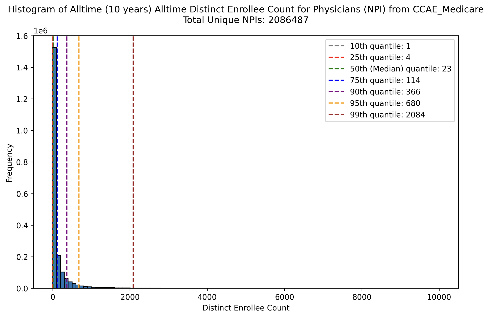
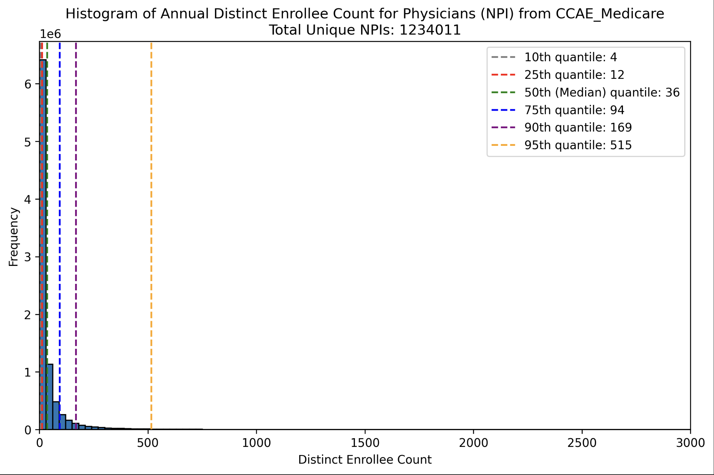
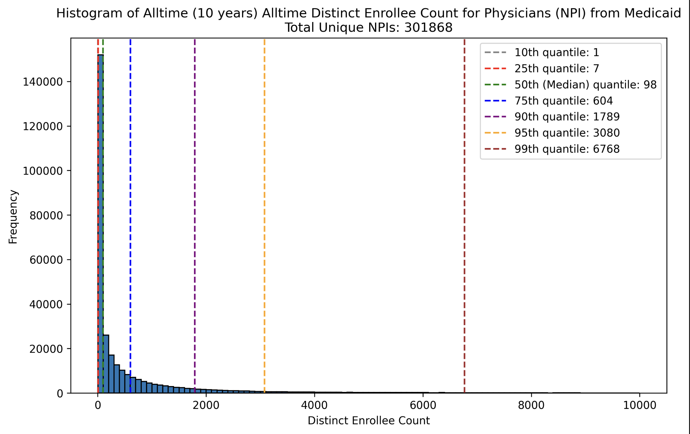
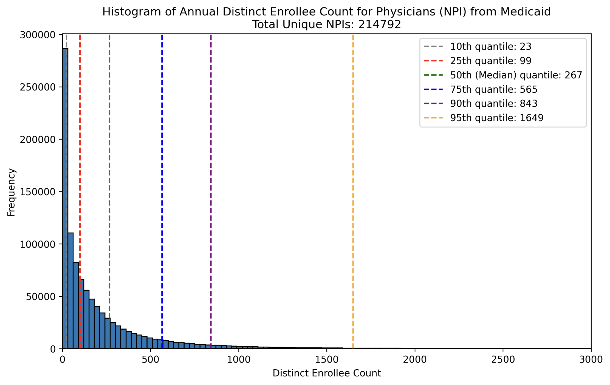

# Provider Exploration
----
### CCAE 

#### Provider Identifiers in Source Data

| Provider ID Type | Data Source | Unique Count | Missing Rate |
|------------------|-------------|--------------|--------------|
| NPI              | Inpatient service   | 984,380      | 53.38%       |
| PROVID           | Inpatient service   | 464,462      | 63.49%       |
| NPI              | Outpatient service  | 2,843,006    | 53.63%       |
| PROVID           | Outpatient service  | 2,216,570    | 66.39%       |

#### Combined Provider Statistics

| Provider ID Type | Total Unique Count | Count with Both Inpatient & Outpatient Enrollees | Percentage |
|------------------|--------------------|-------------------------------------------------|------------|
| NPI              | 11,417,653         | 2,191,261                                       | 19.19%     |
| PROVID           | 4,290,577          | 620,146                                         | 14.45%     |

### MDCR

#### Provider Identifiers in Source Data

| Provider ID Type | Data Source | Unique Count | Missing Rate |
|------------------|-------------|--------------|--------------|
| NPI              | Inpatient service   | 553,809      | 53.07%       |
| PROVID           | Inpatient service   | 330,970      | 65.82%       |
| NPI              | Outpatient service  | 1,525,749    | 54.19%       |
| PROVID           | Outpatient service  | 1,173,611    | 62.35%       |

#### Combined Provider Statistics

| Provider ID Type | Total Unique Count | Count with Both Inpatient & Outpatient Enrollees | Percentage |
|------------------|--------------------|-------------------------------------------------|------------|
| NPI              | 3,707,611          | 864,436                                        | 23.32%     |
| PROVID           | 1,913,181          | 377,586                                        | 19.74%     |

### Combined CCAE and MDCR (Only Physicians)
#### All-time enrollees per NPI 

#### Annual enrollees per NPI: **only select providers with all-time enrollees [10, 5000]**

--- 
### Medicaid
#### Provider Identifiers in Source Data

| Provider ID Type | Data Source | Unique Count | Missing Rate |
|------------------|-------------|--------------|--------------|
| NPI              | Inpatient service   | 238,884      | 24.58%       |
| PROV_ID          | Inpatient service   | 412,191      | 43.06%       |
| NPI              | Outpatient service  | 558,804      | 23.54%       |
| PROV_ID          | Outpatient service  | 1,073,251    | 42.08%       |

#### Combined Provider Statistics

| Provider ID Type | Total Unique Count | Count with Both Inpatient & Outpatient Enrollees | Percentage |
|------------------|--------------------|-------------------------------------------------|------------|
| NPI              | 909,015            | 302,626                                        | 33.29%     |
| PROV_ID          | 1,324,546          | 405,512                                        | 30.62%     |

#### All-time enrollees per NPI (Only Physicians)

#### Annual enrollees per NPI (Only Physicians): **only select providers with all-time enrollees [10, 5000]**

---

## STDPROV REFERENCE TABLE:
| Code | Description |
|------|-------------|
| . | .-Missing/Unknown |
| 1 | 001-Acute Care Hospital |
| 5 | 005-Ambulatory Surgery Centers |
| 6 | 006-Urgent Care Facility |
| 10 | 010-Birthing Center |
| 15 | 015-Treatment Center |
| 20 | 020-Mental Health/Chemical Dep NEC |
| 21 | 021-Mental Health Facilities |
| 22 | 022-Chemical Depend Treatment Ctr |
| 23 | 023-Mental Hlth/Chem Dep Day Care |
| 25 | 025-Rehabilitation Facilities |
| 30 | 030-Longterm Care (NEC) |
| 31 | 031-Extended Care Facility |
| 32 | 032-Geriatric Hospital |
| 33 | 033-Convalescent Care Facility |
| 34 | 034-Intermediate Care Facility |
| 35 | 035-Residential Treatment Center |
| 36 | 036-Continuing Care Retirement Com |
| 37 | 037-Day/Night Care Center |
| 38 | 038-Hospice Facility |
| 40 | 040-Other Facility (NEC) |
| 41 | 041-Infirmary |
| 42 | 042-Special Care Facility (NEC) |
| 100 | 100-Dentist - MD & DDS (NEC) |
| 105 | 105-Dental Specialist |
| 120 | 120-Chiropractor/DCM |
| 130 | 130-Podiatry |
| 140 | 140-Pain Mgmt/Pain Medicine |
| 145 | 145-Pediatric Anesthesiology |
| 150 | 150-Anesthesiology |
| 160 | 160-Nuclear Medicine |
| 170 | 170-Pathology |
| 175 | 175-Pediatric Pathology |
| 180 | 180-Radiology |
| 185 | 185-Pediatric Radiology |
| 200 | 200-Medical Doctor - MD (NEC) |
| 202 | 202-Osteopathic Medicine |
| 204 | 204-Internal Medicine (NEC) |
| 206 | 206-MultiSpecialty Physician Group |
| 208 | 208-Proctology |
| 210 | 210-Urology |
| 215 | 215-Dermatology |
| 220 | 220-Emergency Medicine |
| 225 | 225-Hospitalist |
| 227 | 227-Palliative Medicine |
| 230 | 230-Allergy & Immunology |
| 240 | 240-Family Practice |
| 245 | 245-Geriatric Medicine |
| 250 | 250-Cardiovascular Dis/Cardiology |
| 260 | 260-Neurology |
| 265 | 265-Critical Care Medicine |
| 270 | 270-Endocrinology & Metabolism |
| 275 | 275-Gastroenterology |
| 280 | 280-Hematology |
| 285 | 285-Infectious Disease |
| 290 | 290-Nephrology |
| 295 | 295-Pulmonary Disease |
| 300 | 300-Rheumatology |
| 320 | 320-Obstetrics & Gynecology |
| 325 | 325-Genetics |
| 330 | 330-Ophthalmology |
| 340 | 340-Otolaryngology |
| 350 | 350-Physical Medicine & Rehab |
| 355 | 355-Plastic/Maxillofacial Surgery |
| 360 | 360-Preventative Medicine |
| 365 | 365-Psychiatry |
| 380 | 380-Oncology |
| 400 | 400-Pediatrician (NEC) |
| 410 | 410-Pediatric Specialist (NEC) |
| 413 | 413-Pediatric Nephrology |
| 415 | 415-Pediatric Ophthalmology |
| 418 | 418-Pediatric Orthopaedics |
| 420 | 420-Pediatric Otolaryngology |
| 423 | 423-Pediatric Critical Care Med |
| 425 | 425-Pediatric Pulmonology |
| 428 | 428-Pediatric Emergency Medicine |
| 430 | 430-Pediatric Allergy & Immunology |
| 433 | 433-Pediatric Endocrinology |
| 435 | 435-Neonatal-Perinatal Medicine |
| 438 | 438-Pediatric Gastroenterology |
| 440 | 440-Pediatric Cardiology |
| 443 | 443-Pediatric Hematology-Oncology |
| 448 | 448-Pediatric Infectious Diseases |
| 450 | 450-Pediatric Rheumatology |
| 453 | 453-Sports Medicine (Pediatrics) |
| 455 | 455-Pediatric Urology |
| 458 | 458-Child Psychiatry |
| 460 | 460-Pediatric Medical Toxicology |
| 500 | 500-Surgeon (NEC) |
| 505 | 505-Surgical Specialist (NEC) |
| 510 | 510-Colon & Rectal Surgery |
| 520 | 520-Neurological Surgery |
| 530 | 530-Orthopaedic Surgery |
| 535 | 535-Abdominal Surgery |
| 540 | 540-Cardiovascular Surgery |
| 545 | 545-Dermatologic Surgery |
| 550 | 550-General Vascular Surgery |
| 555 | 555-Head and Neck Surgery |
| 560 | 560-Pediatric Surgery |
| 565 | 565-Surgical Critical Care |
| 570 | 570-Transplant Surgery |
| 575 | 575-Traumatic Surgery |
| 580 | 580-Cardiothoracic Surgery |
| 585 | 585-Thoracic Surgery |
| 805 | 805-Dental Technician |
| 810 | 810-Dietitian |
| 815 | 815-Medical Technician |
| 820 | 820-Midwife |
| 822 | 822-Nursing Services |
| 824 | 824-Psychiatric Nurse |
| 825 | 825-Nurse Practitioner |
| 827 | 827-Nurse Anesthetist |
| 830 | 830-Optometrist |
| 835 | 835-Optician |
| 840 | 840-Pharmacist |
| 845 | 845-Physician Assistant |
| 850 | 850-Therapy (Physical) |
| 853 | 853-Therapists (Supportive) |
| 855 | 855-Therapists (Alternative) |
| 857 | 857-Renal Dialysis Therapy |
| 860 | 860-Psychologist |
| 865 | 865-Acupuncturist |
| 870 | 870-Spiritual Healers |
| 900 | 900-Health Educator/Agency |
| 905 | 905-Transportation |
| 910 | 910-Health Resort |
| 915 | 915-Hearing Labs |
| 920 | 920-Home Health Organiz/Agency |
| 925 | 925-Imaging Center |
| 930 | 930-Laboratory |
| 935 | 935-Pharmacy |
| 940 | 940-Supply Center |
| 945 | 945-Vision Center |
| 950 | 950-Public Health Agency |
| 955 | 955-Unknown Clinic |
| 960 | 960-Case Manager |
